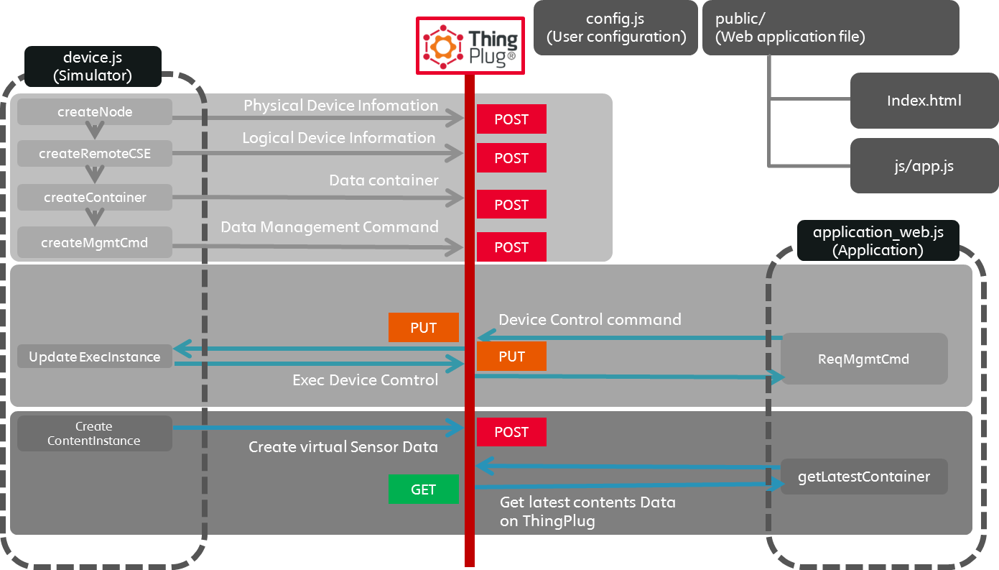
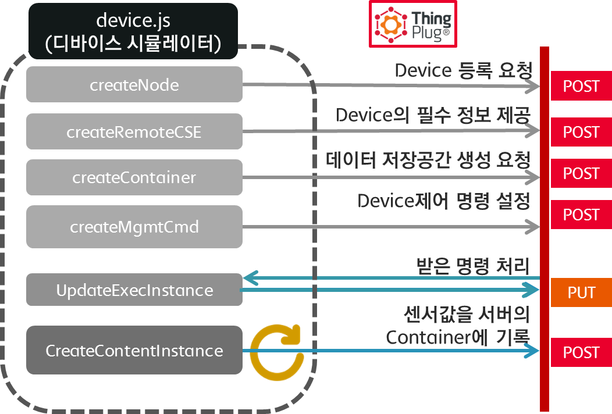
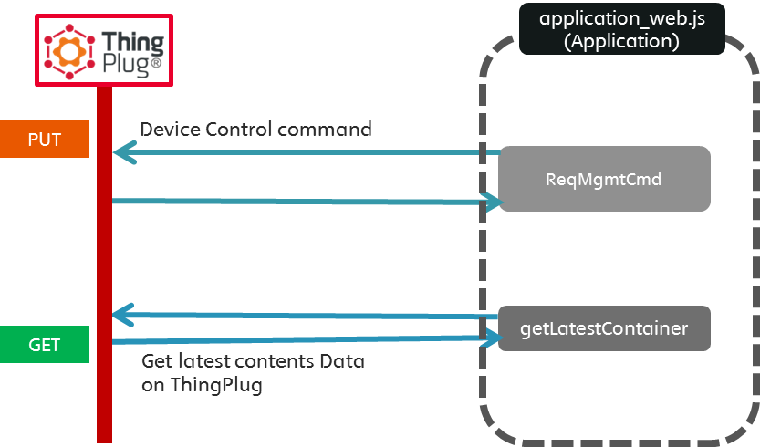
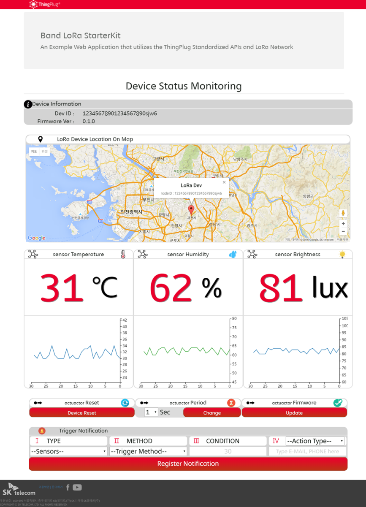

<span id="starter-kit의-목적" class="anchor"><span id="_Toc462242519" class="anchor"></span></span>Purpose of Starter Kit
-------------------------------------------------------------------------------------------------------------------------

This Starter Kit is a device and application simulator that helps to develop LoRa service environment using oneM2M API provided from SKT’s IoT platform, ThingPlug. Through this Starter Kit, it is possible to test diverse service scenarios quickly and easily. This Starter Kit is created to help developers to get used to the ThingPlug functions and services. Start with this Starter Kit to develop various IoT services in ThingPlug.


\[Figure 1\] Purpose of ThingPlug Starter Kit

### Main Features and Functions of ThingPlug Starter Kit for LoRa

-   It is a module that enables service testing even though there is no actual device used.

-   It provides REST API of oneM2M, a global standards initiative for M2M communications and IoT.

-   It consists of node.js and express web application framework, thus enables easy development and modification.

-   It provides sample interface between data and service through various built-in components such as IFTTT, map, graph, etc.

-   Samples are uploaded in the Github. It is possible to download directly from the Github.

    1.  ### Major Components of ThingPlug API

Starter Kit consists of the following four components depending on their roles.



\[Figure 2\] ThingPlug Starter Kit Composition

-   Application client (Application)

-   Device client (Device)

-   ThingPlug server that provides oneM2M API (ThingPlug)

-   LoRa network server

Application and device do not communicate with each other directly. All components in the Starter Kit communicate with oneM2M server using REST API, which is provided from the ThingPlug. Common IoT functions (e.g. saving data, managing devices, registering devices, etc.) provided through the relevant API will present the device and application developers the environment where it is easier to develop LoRa services.

<span id="starter-kit-실행절차-요약" class="anchor"><span id="_Toc462242522" class="anchor"></span></span>Starter Kit Execution Procedures
------------------------------------------------------------------------------------------------------------------------------------------

Follow the procedures below to execute the Starter Kit.

1.  Preparation: Install required tools

2.  Copy code

3.  Install project dependency

4.  Modify some files (config.js) according to your ThingPlug account information

5.  Execute the Device.js

6.  Register the device into your ThingPlug account

7.  Execute the Application\_web.js

    1.  ### <span id="사전-준비" class="anchor"><span id="_Toc462242523" class="anchor"></span></span>Preparation

#### Install Node

Install the following tool to execute the Starter Kit.

-   [Node.js](https://nodejs.org): Download the installation package from the official website.

> 
>
> \[Figure 3\] Install node.js

### <span id="코드-복사" class="anchor"><span id="_Toc462242524" class="anchor"></span></span>Copy Code

Download the compressed project file released in Git and then decompress the file into a temporary folder. Or you can clone the master version of github by using the following command.

    git clone https://github.com/SKT-ThingPlug/thingplug-lora-starter-kit.git

The decompressed or cloned folder contains the following major files.

> 
>
> \[Figure 4\] Download Starter Kit from github

-   `config_x.js`: It contains necessary environment setting values such as developer key, device ID, etc. Developer should modify the values according to his/her condition.

-   `device_mqtt_x.js`: It is a code, made by Node.js, that can run in the actual IoT device. It can run on any computer or IoT device (e.g. [BeegleBone Black](http://beagleboard.org/black)), where Node.js can be executed. This js file uses mqtt protocol.

-   `device_http_x.js`: It is an http version of the device.js.

-   `application_web.js`: It is a web API server that uses Express.js. It plays the role of backend server that responds to the call of sample web application. It shows users the data sent from `device.js` to ThingPlug or receives command from web page and actually controls device through the ThingPlug server.

-   `public/`: It is a static file list (html, css, javascript, etc.) of sample web application.

-   `notification/`: There is a file related to email that is used to notify problem when a trigger occurs. Currently, email is sent using nodemailerapi. Enter the GMAIL account into mail.js. Developer can use various other methods besides this using the library of node.js.

> Currently, the sample is mapped in ***{js filename***`_number}` format to support the multi device.

There are several modifications required to change the number of the device.

1.  `Add or delete the ``config_x.js`` and` `device_x.js`` files `(number should start with 1 consecutively)

2.  Modify the node ID of `config_x.j`s

3.  Modify the`numOfDevice` of `application_web.js`

4.  Modify the `numOfDevice` of `/public/js/app.js`

### <span id="프로젝트-dependency-설치" class="anchor"><span id="_Toc462242525" class="anchor"></span></span>Install Project Dependency

Device and application executed by Starter Kit are within the Node.js and relevant dependency information is entered in the package.json. Go to the starter kit folder (where package.json exists) copied in the former process and install the dependency using `npm install`` command.`

<span id="config.js-수정" class="anchor"></span>

### Modify config.js

To run the Starter Kit normally, it is necessary to modify the information of developer account and device according to the developer’s condition. Copy `config.js_sample` file to `config.js` file and then open `config.js` from the editor. Refer to the comments and descriptions below when modifying the file.

```javascript
module.exports = {

  AppEUI : 'starterkittest',                   		// Application EUI
  DevEUI : 'DevEUI',								// Device EUI
  version : 'v1_0',                             	// Application version
  TPhost : 'thingplugtest.sktiot.com',      		// ThingPlug HOST Addresss
  TPport : '9000',                             		// ThingPlug HTTP PORT

  responseAddress : 'http://0.0.0.0',         		// Physical address (mga) of device for controlling the device in HTTP version
  responsePORT : '0000',                        	// Physical address (local port) of device for controlling the device in HTTP version

  userID : 'userID',                            	// MQTT버전에서 Broker 접속을 위한 ID, 포털 ID 사용
  mqttClientId : 'Please Make Ramdom Value_1',    	// MQTT버전에서 Broker 접속을 위한 client ID

  nodeID : 'Please Type Your Own LTID',         	// Enter the unique ID to identify device (nodeID, CSE-ID)
  passCode : '000101',                          	// Register the passCode that will be used when registering device into the portal
  uKey : 'USER KEY FROM PORTAL',                	// USER access token key from Portal

  containerName:'LoRa',                         	// Container name that will be created and used in the Starter Kit (define temporarily)
  DevReset : 'DevReset',                        	// Control command (DevReset) that will be created and used in the Starter Kit 
  RepPerChange : 'RepPerChange',                	// Control command (RepPerChange) that will be created and used in the Starter Kit 
  RepImmediate : 'RepImmediate',                	// Control command (RepImmediate) that will be created and used in the Starter Kit
  extDevMgmt : 'extDevMgmt',						// Control command (extDevMgmt) that will be created and used in the Starter Kit
  
  UPDATE_CONTENT_INTERVAL : 1000,					//contentInstance Term
 
  delimiter : ',',									// contents delimiter															
 
  contents : function(){															// Data from Device(contentInstance Attribute <con>)
	var value_TEMP = (Math.floor(Math.random() * 5) + this.BASE_TEMP).toString();	// Virtual Temp value
	var value_HUMID = (Math.floor(Math.random() * 5) + this.BASE_HUMID).toString();	// Virtual Humidity value
	var value_LUX = (Math.floor(Math.random() * 5) + this.BASE_LUX).toString();		// Virtual Brightness value

	return value_TEMP + this.delimiter + value_HUMID + this.delimiter + value_LUX;
  }
};
```                                                                                                                                                                      

> Necessary modification when using device_http<br>
	responseAddress, responsePORT, uKey, nodeID, passCode

> Necessary modifications when using device_mqtt<br>
	userID, uKey, mqttClientId, nodeID, passCode                                                                                                                                                                      
                                                                                                                                                                                        |
|---------------------------------------------------------------------------------------------------------------------------------------------------------------------------------------|

<span id="device-실행" class="anchor"></span>

### Execute Device

#### Roles of Devices

| Division                   | Description                                                                                                                    | HTTP Method (MQTT Publish) |
|----------------------------|--------------------------------------------------------------------------------------------------------------------------------|----------------------------|
| 1. Create Node             | Register physical device.                                                                                                      | POST                       |
| 2. Create remoteCSE        | Register the service, remoteCSE ID, and passCode into oneM2M server. Save data (uKey) generated from the service.              | POST                       |
| 3. Create Container        | Create container for saving data. It is similar to folder in file system.                                                      | POST                       |
| 4. Create mgmtCmd          | Create resources including control command that can be accepted by the device. In case of LoRa, there are predefined commands. | POST                       |
| 5. Create Content Instance | Record the sensor data into specified container.                                                                               | POST                       |
| 6. Update exec Instance    | Update the result of exec Instance sent from the ThingPlug.                                                                    | PUT                        |

-   In case of MQTT version, device actions are divided based on the `isRunning` status. Receive response from the ThingPlug through `Subscribe` and request for HTTP to ThingPlug through `Publish`.



`
`

-   `To send the actual sensor data to ThingPlug and receive relevant response from the application, ``modify the CON value, which is a parameter of ``contentInstance`` in ``device.js`` files.`


`In the sample above, modify the ``value_Temp``.`

#### Device Execution Result

It is normal if you see the following result screen.


\[Figure 5\] device\_mqtt Execution Result

### <span id="device가-하는-일" class="anchor"><span id="thingplug에-내-계정에-device를-등록" class="anchor"><span id="_Toc462242528" class="anchor"></span></span></span>Register Device into Your ThingPlug Account

#### Sign Up

When two devices (B and C in the figure below) are registered under the user A, user D should not be able to access the two devices. uKey is used to handle this kind of cases and user can get it by signing up.

-   **uKey **

    -   Access token key that judges whether an access from an external system to the ThingPlug Rest API is normal or not.

(Use uKey as a user credential of Mqtt client)


\[Figure 6\] Necessity of uKey

1.  **Sign up: [https://thingplugdev.sktiot.com](https://thingplug.sktiot.com/)**


1.  **Device interface protocol: Select HTTP**


1.  **User authentication key: uKey (created by the system)**

#### Register Device

Register the device (created remoteCSE) into the ThingPlug portal so that application can send necessary control commands using the ThingPlug oneM2M REST API.

-   Before registering the device, node and remoteCSE resources should be registered successfully into the ThingPlug portal.

-   Device is identified by device ID (nodeID) and passCode

    -   **passCode**

        -   It is a user-defined password that will be used to identify device in the portal (4 – 16 characters or numbers).

        -   It will be used when registering device.

        1.  Log in to \[ThingPlug\] &gt; My Page &gt; My Device &gt; Add Device.

            

        2.  Enter the device ID (LTID) and passCode of Config.js into the Single Upload section and then click Verify Device Info button.

            

        3.  Enter the following information into the Required Information section and then click Save button.

        4.  Device is registered successfully into the ThingPlug.

            

1.  Check the registered device from My Page &gt; My Device.

    

### <span id="application-실행" class="anchor"><span id="_Toc462242529" class="anchor"></span></span>Execute Application

`Execute the application using ``node application_web.js` command. (Before executing the application, d`evice.js` should operate normally.) So, do not terminate the execution of `device.js`, but just open a new terminal (command window). ``

Go to [http://\[SERVER\_IP\]:3000/dashboard](http://[SERVER_IP]:3000/dashboard) to check the web page.

In the above web page, it is possible to view the location of device and values of 3 virtual sensors, execute mgmtCmd that is predefined in the device, and send email notification by setting trigger when event occurs.



\[Figure 7\] Role of Application.js

#### Roles of Application

| Division                          | Description                                                             | Method         |
|-----------------------------------|-------------------------------------------------------------------------|----------------|
| 1. Retrieve Content Instance      | Retrieve the latest content Instance.                                   | HTTP GET       |
| 2. Request for mgmtCmd            | Send control command, which should be sent to device, to the ThingPlug. | HTTP POST      |
| 2-1. DevReset                     | mgmtCmd for resetting LoRa device.                                      |                |
| 2-2. RepPerChange                 | mgmtCmd for changing uplink (regular report) cycle of LoRa device.      |                |
| 2-3. RepImmediate                 | mgmtCmd for the immediate report of LoRa device uplink (regular report) |                |
| 3. Retrieve mgmtCmd exec Instance | Retrieve the status of control command sent to device.                  | HTTP GET       |
| 4. Sensor Display                 | Show sensor data (temperature, humidity, brightness) in graphs.         | d3 API         |
| 5. Google Map API                 | Show location of LoRa device.                                           | Google API     |
| 6. Trigger Setting                | Notify when trigger occurs.                                             | nodemailer API |

#### Request for Control from Application

After execution, application requests for the control of device. See the terminal below, where device.js is running, and you will be able to see the log of mgmtCmd that application sent.


\[Figure 7-1\] mgmtCmd Request from Web App Using Button

Example of Application\_web code

    ////////////CODE EXAMPLE in /public/js/app.js////////////////
    ///When button is clicked, application sends mgmtCmd(DevReset)///////
    $('#DevReset').on('click',function(event) {
    $.post('/control',{cmt:'DevReset',cmd:'request'},function(data,status){
    });
    });


\[Figure 7-2\] Request for mgmtCmd Using Argument from CLI


\[Figure 8\] Console Log when device.js Received mgmtCmd Push Message

*///////CODE EXAMPLE in device.js///////////*

1. Example of device\_http.js
*////////////response for HTTP//////////////*
httpRes.createServer(**function** (req, res) {
...*// Process the request and send response*
}).listen(ResponsePORT);

2. Example of device\_mqtt.js
*////////////response for MQTT//////////////*
client.on('message',**function**(topic, message){
**var**msgs=message.toString().split(',');
xml2js.parseString( msgs\[0\],**function**(err,xmlObj){
...*// Process the request and send response*
*/////////condition branch device.js//////////////////*
**if**(cmt=='RepImmediate'){*// Report directly*
...
}
**elseif**(cmt=='RepPerChange'){*// Change cycle*
...
}
**elseif**(cmt=='DevReset'){*// Initialize the device*
...
}
**else**{
}
});

#### Register Trigger



Sends email notification when there is a particular event related to sensor data.

Nodemailer library is used. Use your email and smtp addresses to receive device information when an event occurs.

#### <span id="application-하는-일" class="anchor"><span id="web-application-실행" class="anchor"></span></span>Execute Web Application

`Execute`` `Express.js server using` ``node application_w``eb.j``s` command. Open the web browser, access to the running server IP, and then execute the dashboard. Dashboard url for the virtual sensor is [http://\[SERVER\_IP\]:3000/dashboard](http://[SERVER_IP]:3000/dashboard). Execute `node device.js` to display the virtual sensor data on dashboard. To modify contents of the actual actions of the relevant application, modify the web page from `/public/index.html`` `file and then modify contents that are related to the actual actions from `/public/js/app.js` file.

> 

<span id="환영합니다.-당신은-이제-thingplug-lora-iot-user입니다" class="anchor"><span id="faq" class="anchor"></span></span>\[Figure 9\] Starter Kit Web Application Execution Result

FAQ
---

#### Welcome. Now you are a ThingPlug LoRa IoT user.

You are finished with preparing all the required settings for the SKT ThingPlug LoRa using this Starter Kit. Now make the service you want using the application and device codes. Contact [ThingPlug Developer Community](https://sandbox.sktiot.com/IoTPortal/cmmnty/cmmntyList) when you have any question while developing service.

#### For more information of the Starter Kit, refer to the ThingPlug Guidebook.

Refer to the [IoT Service Development with ThingPlug](http://book.naver.com/bookdb/book_detail.nhn?bid=9766474).

#### Do I need to register resources every time I execute the device?

No. You need to register the resources of each device only once at the very first time. In this Starter Kit, resources are registered every time you execute the device. Still, there is no problem with this process. However, when you try to use the same ID, conflict (HTTP : 409, MQTT : 4015) message will occur.

#### I can’t find user authentication key in My Page.

You must select HTTP for the device interface protocol when you sign up the ThingPlug portal. If not, you won’t be able to use oneM2M API. You can select this option only when you sign up the portal. Therefore, create a new account using a new ID and make sure to select HTTP option.

#### I cannot connect to MQTT.

Check if your ThingPlug ID and uKey are entered normally in the config file. When clientId is overlapped with someone else’s, it may cause problem.

#### I cannot see the sensor data.

Check if you registered device into the ThingPlug portal also. If device is not registered in the portal, uKey is not properly mapped and application cannot access the device.

#### It says that config.js does not exist.

Check if you modified the sample codes or deleted sample from the file name.
